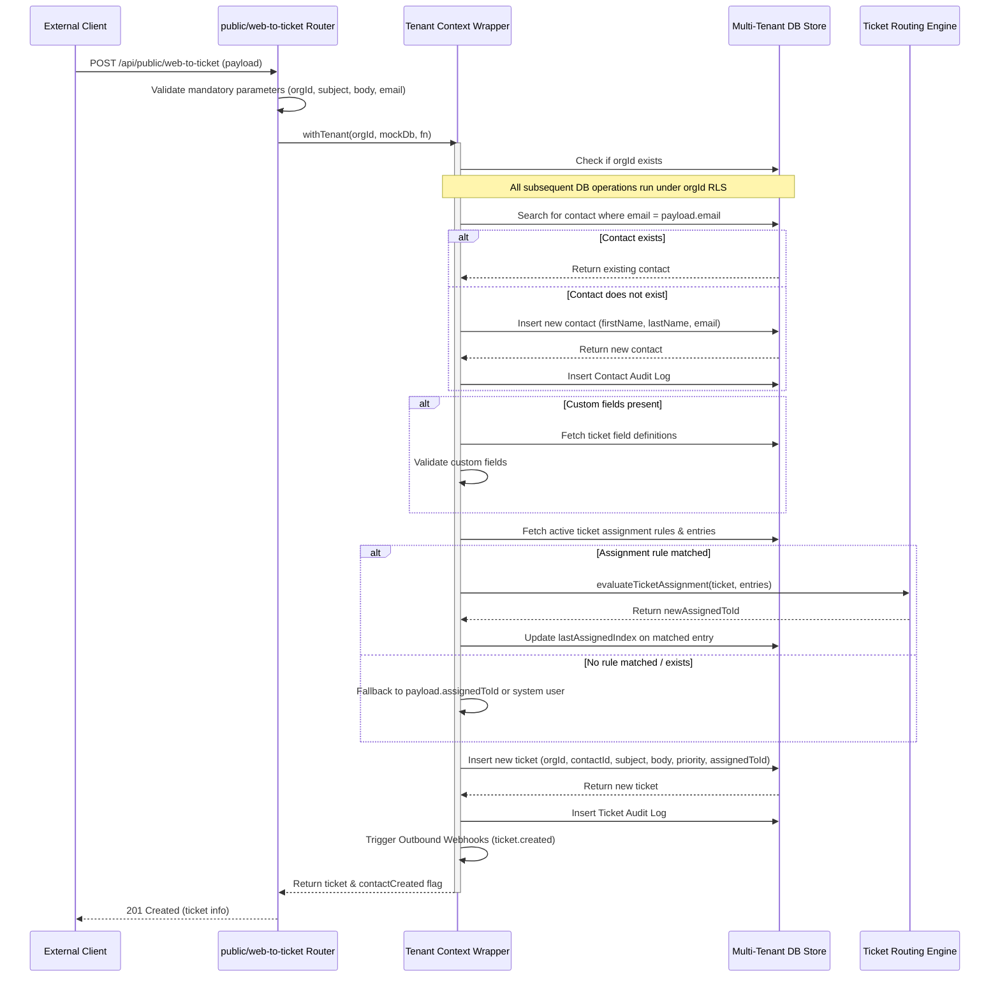

# Task 0161: Public Web-to-Ticket Capture API - Design

## 1. API Definition

### Endpoint
`POST /api/public/web-to-ticket`

### Request Header
`Content-Type: application/json`

### Request Payload Schema
```json
{
  "orgId": "UUID",
  "subject": "string",
  "body": "string",
  "email": "string",
  "firstName": "string (optional)",
  "lastName": "string (optional, defaults to 'Web Contact')",
  "priority": "Low | Medium | High | Urgent (optional, defaults to 'Medium')",
  "assignedToId": "UUID (optional)",
  "custom": {
    "custom_field_api_name": "value"
  }
}
```

### Success Response (Status 201 Created)
```json
{
  "success": true,
  "data": {
    "id": "ticket-uuid",
    "orgId": "org-uuid",
    "contactId": "contact-uuid",
    "subject": "string",
    "status": "Open",
    "priority": "Medium",
    "assignedToId": "user-uuid",
    "createdAt": "date-string"
  },
  "contactCreated": true | false
}
```

### Error Responses
- **400 Bad Request**: Missing mandatory fields or non-existent `orgId`.
- **400 Bad Request**: Custom fields validation failed.

---

## 2. Core Processing Sequence

The endpoint logic operates inside an asynchronous wrapper executing these operations sequentially:



---

## 3. Data Integrity & RLS Verification
- **Dynamic Context Binding**: Because the API is public, it skips the normal `tenantAuth` middleware which sets context based on authentication tokens. Instead, the endpoint itself sets the tenant context using `withTenant(orgId, mockDb, ...)` before calling any store method.
- **Strict Store Level Assertions**: All mock store methods (`dbStore.contacts`, `dbStore.tickets`, `dbStore.auditLogs`, etc.) verify `getActiveOrgId() === record.orgId` on insert and filter by `orgId` on query, automatically blocking any cross-tenant reading or writing.
