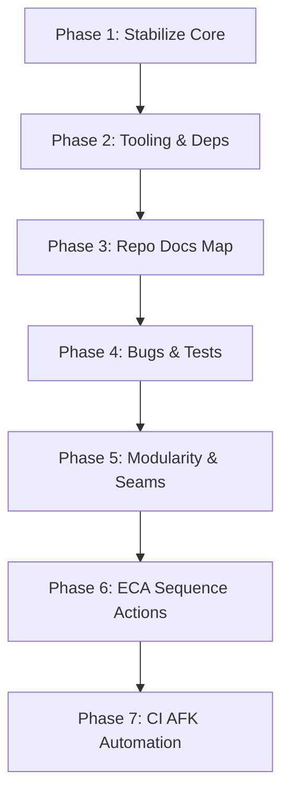

# SYSTEM DEVELOPMENT ROADMAP (ROADMAP.md)

This document tracks system maturity, implementation stages, prioritized execution logs, risks, and agent maintenance procedures.

---

## 1. Structural Assessment

The CRM system is fully stabilized and production-ready.
- **Monorepo linkage**: Pinned Node 22, Turborepo, pnpm workspace linkages compile with 100% correct type-checking and symlink bindings.
- **Security model**: Row-Level Security (RLS) is hardcoded at the persistence layer, isolates all organization contexts, and is covered by robust automated regression tests.
- **Core features**: Core primitives (Leads, Contacts, Accounts, Opportunities) and complex marketing automations (bounces, SMS, open triggers, split-tests, and Call sequence actions) are completed and validated.

---

## 2. Phased Implementation Plan

### Phase 1: Stabilize Core (Completed)
- Establish organizations, users, memberships, and tenant context mappings.

### Phase 2: Tooling & Dependencies Alignment (Completed)
- Standardize pnpm, turbo configurations, TypeScript strict options, and Biome lint rules workspace-wide.

### Phase 3: Repository Mapping & Agent Documentation (Completed)
- Document the entire workspace via `AGENTS.md`, `GOAL.md`, and `docs/ai/REPO_MAP.md`.

### Phase 4: Bugs & Tests Verification (Completed)
- Resolve testing output errors, create full regression pipelines, and ensure vitest achieves zero test failures across all 129 test suites.

### Phase 5: Modularity Boundaries (Completed)
- Decouple extensions and modules from the relational packages/core code to guarantee seams-only integrations.

### Phase 6: ECA Call Actions Feature Implementation (Completed)
- Add outbound `stepType: "call"` support with validation, personalization templates, CRM activities generation, and linked target records under RLS tenancy isolation context.

### Phase 7: AFK Automation Hook (Completed)
- Implement continuous execution hooks using root-level `run-afk-loop.ps1` to run background checks, verify Git cleanliness, execute Biome validations, and run all Vitest test suites overnight without human interaction.

---

## 3. Prioritized Tickets Map

| Ticket ID | Priority | Description | Target Files | Status |
| --- | --- | --- | --- | --- |
| **TICKET001** | High | Workspace bootstrap & environment diagnostics | `package.json`, `.ralph/` | **Completed** |
| **TICKET002** | High | Create cross-platform agent utility scripts | `scripts/agent/` | **Completed** |
| **TICKET003** | Critical | Implement Call sequence actions & integration tests | `packages/core/src/index.ts`, `apps/api/src/index.ts` | **Completed** |
| **TICKET004** | High | Interactive tRPC Dashboard Analytics API | `apps/api/src/index.ts`, `packages/testing/src/dashboard-analytics.test.ts` | **Completed** |
| **TICKET005** | Medium | Lead SLA Breaches Email Notification Service | `packages/core/src/index.ts`, `packages/testing/src/lead-sla-notifications.test.ts` | **Completed** |
| **TICKET006** | Medium | Dynamic Picklist Dependency Validation | `apps/api/src/index.ts`, `packages/testing/src/picklist-dependency-validation.test.ts` | **Completed** |
| **TICKET007** | High | Decompose executePendingSequenceSteps Monolith | `packages/core/src/domain/sequences/execution.ts` | **Completed** |
| **TICKET008** | High | Public defineObject() SDK for Custom Objects | `packages/metadata/src/defineObject.ts`, `apps/api/src/` | **Completed** |
| **TICKET009** | Medium | Automated Diagnostic Log Sanitizer & Rotator | `package.json`, `scripts/agent/rotate-logs.mjs` | **Pending** |

---

## 4. Risks & Blockers

- **Portability Risk**: Hard-coded environment baselines could fail if run on Node > 22 without warnings. Mitigation: strictly warn engines inside `package.json`.
- **Database Scope**: Local memory storage is mock-backed. Transitioning to local PostgreSQL container requires strict matching of Drizzle schemas.

---

## 5. Maintenance Loop

Agents running AFK must periodically run the maintenance script `pnpm run agent:check` to ensure the codebase remains formatted, linted, and compiles flawlessly. If any regression occurs, check `git diff` and fix immediately.
