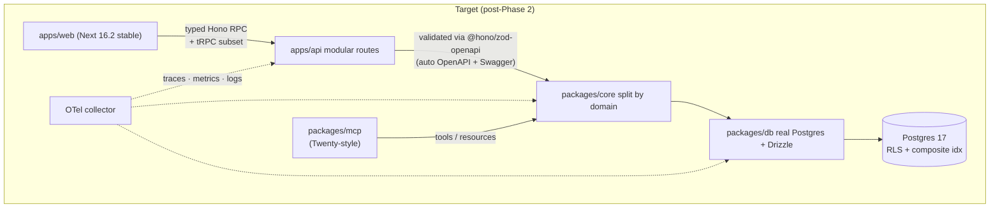
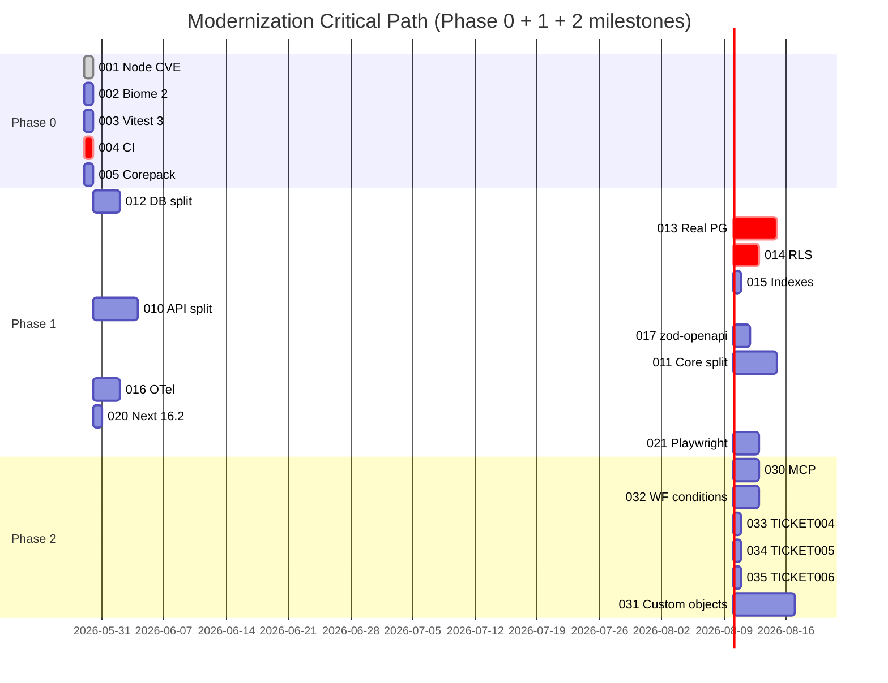

# /plan/ROADMAP.md — 2026 Modernization Blueprint

> Audit date: 2026-05-29 · Author: Principal SWE Agent (Opus 4.7, 1M ctx)
> Source repo: `agy-ralph-crm` (multi-tenant CRM core; Node 22 / pnpm + turbo / Hono + Next.js 16-alpha / Drizzle + mock Postgres / Vitest 1.6 / Biome 1.8)

---

## 1. REPO BASELINE

**Purpose.** Modular multi-tenant CRM operating system designed for autonomous AI execution. Core primitives: Accounts/Contacts/Leads/Opportunities, activity timelines, marketing automation with ECA (event-condition-action) sequences. 130 ralph specs delivered; 403 vitest tests / 129 files green.

**Stack scale.**

| Surface | Tech | Version | Lines | Status |
| --- | --- | --- | --- | --- |
| Monorepo orchestration | pnpm + turborepo | 11.1.2 + 2.x | — | ✅ green |
| Runtime | Node.js | 22.0.0 pinned (local 24.15) | — | ⚠️ Jan/Mar 2026 CVEs require 22.22.0+ |
| API | Hono | 4.0.0 | `apps/api/src/index.ts` ≈ 13,060 | 🚨 monolith violates 400-line budget by 32× |
| Web | Next.js | 16.0.0-alpha.0 (React 19) | `apps/web/src/app/` | ⚠️ alpha; 16.2 stable available |
| Domain logic | Pure TS | — | `packages/core/src/index.ts` ≈ 9,505 | 🚨 monolith |
| Persistence | Drizzle + Postgres | 0.30 (mock-backed) | `packages/db/src/index.ts` ≈ 6,312; `schema.ts` ≈ 1,645 | 🚨 mock store, real Postgres not wired |
| Tests | Vitest | 1.6.0 | 129 files / 403 tests | ⚠️ v3 available, 40% faster on large suites |
| Lint/Format | Biome | 1.8.0 | — | ⚠️ v2.4 available |
| Validation | Zod | 3.23 | — | ✅ |
| Observability | — | — | — | 🚨 zero OTel / structured logs / metrics |
| CI | — | — | — | 🚨 no `.github/workflows/` |
| E2E | — | — | — | 🚨 no Playwright config |

**Architecture (current vs target).**

```mermaid
graph TD
  subgraph "Current (2026-05-29)"
    APIcur["apps/api/src/index.ts<br/>13K-line monolith"]
    Corecur["packages/core/src/index.ts<br/>9.5K-line monolith"]
    DBcur["packages/db/src/index.ts<br/>6.3K-line mock store"]
    Webcur["apps/web (Next 16-α)"]
    Webcur --> APIcur
    APIcur --> Corecur
    Corecur --> DBcur
    DBcur -.->|"in-memory<br/>(NOT real PG)"| MockMap[("Map/Array"):::mock]
  end
  classDef mock fill:#ffd,stroke:#900;
```



---

## 2. KEY GAPS (audit findings)

Concrete counts from sub-agent audit (`Explore` 2026-05-29):

1. **Single-file monoliths.** `apps/api/src/index.ts` holds **331 Hono routes** in 13,060 lines. `packages/core/src/index.ts` holds 100+ unrelated exported functions (lead scoring, ticket routing, CSAT, campaign ROI…) in 9,505 lines. `packages/db/src/index.ts` is 6,312 lines of mock store + RLS plumbing. All three blow past `ralph.yml`'s 400-line budget by 15–32×.
2. **Mock-backed persistence.** `packages/db/src/index.ts` is an in-memory `Array`-backed store. `packages/db/src/schema.ts` (Drizzle, 1,645 lines) exists but is **not consumed by `index.ts`** — schema and runtime are divorced. No real Postgres queries. No transactions; concurrent writes to arrays are unsync'd.
3. **Manual RLS in 70+ places.** Every `dbStore.*` operation repeats `if (entity.orgId !== getActiveOrgId()) throw "RLS Isolation Violation"`. Should be a query middleware / single chokepoint.
4. **Math.random() IDs in 111 sites.** Not cryptographically secure; collision-prone at scale. Should be `uuid v7` (time-ordered) or `nanoid`.
5. **20+ `as any` / `as unknown` casts in `apps/api`.** Concentrated at DB boundary (lines 324, 1305, 1444, 1892, 2365, 3947–4012, 4550). Weak typing.
6. **All 129 test files import directly from `apps/api/src/index`.** `import app from "../../../apps/api/src/index"` — critical coupling. Any API split (spec 010) forces test refactor (spec 023).
7. **Drizzle schema has no indexes declared.** `orgId`, `ownerId`, `email` are queried but un-indexed. JSONB columns (`opportunities.custom`, `accounts.custom`) have no Zod validation at insert.
8. **No CI** — no `.github/workflows/`; AFK loop is local only.
9. **No observability** — zero OTel traces/metrics/structured logs.
10. **Outdated dev tooling** — Biome 1.8 (→ 2.4), Vitest 1.6 (→ 3.x), Drizzle 0.30 (→ 0.4x).
11. **Node 22 CVE exposure** — Jan + Mar 2026 security releases patch 8+ CVEs (CVE-2025-55131 buffer leak, CVE-2025-55130 fs sandbox escape, CVE-2025-59465 HTTP/2 DoS). Package pin is `22.0.0` exact.
12. **No OpenAPI / typed client** — Hono routes hand-written; no `@hono/zod-openapi`; no shared typed client for `apps/web`.
13. **No E2E** — Playwright config absent.
14. **Stale Next.js alpha** — `16.0.0-alpha.0` (year-old); 16.2 stable adds Turbopack default + React Compiler + DevTools MCP.
15. **Workflow engine gap vs Twenty** — Twenty 2.0 lacks `IF` conditions + `FOREACH` loops in its workflow engine; this repo has the same gap. Closing = competitive differentiation.
16. **MCP surface is buried** — `modules/service-lite` includes MCP; Twenty 2.0 promotes a native MCP server per workspace. Should be first-class `packages/mcp`.
17. **No custom-objects public API** — `packages/metadata` exists but no `defineObject()` SDK (Twenty's killer feature).

---

## 3. EXECUTION WAVES

### Phase 0 — Quick Wins & Safety (≤ 1 day total, parallelizable)
Goal: close security and tooling deltas without behavior changes. Every change must keep `pnpm verify && pnpm test` green.

### Phase 1 — Core Upgrades (1–2 weeks, sequential dependencies)
Goal: modularize monoliths, wire real Postgres + RLS, add CI + observability, upgrade Next.js to stable. After Phase 1 the repo is production-deployable.

### Phase 2 — Major Features (3+ weeks)
Goal: ship the differentiators (first-class MCP, no-code custom objects, workflow conditions/foreach, pgvector search). After Phase 2 the repo is competitive with Twenty 2.0.

---

## 4. MASTER PRIORITIZATION TABLE

Score = (Impact × Fit) ÷ (Risk × (6 - Feasibility)). Higher = ship sooner. 1–5 scale.

| Spec | Title | Phase | Impact | Feasibility | Risk | Fit | Score | Dep |
| --- | --- | --- | --- | --- | --- | --- | --- | --- |
| [001](./specs/001_node_22_security_patch.md) | Bump Node 22 → 22.22.0+ for Jan/Mar 2026 CVEs | 0 | 5 | 5 | 1 | 5 | **25.0** | — |
| [002](./specs/002_upgrade_biome_2_4.md) | Biome 1.8 → 2.4 (domains, type-aware linting, plugins) | 0 | 3 | 5 | 2 | 4 | **6.0** | — |
| [003](./specs/003_upgrade_vitest_3.md) | Vitest 1.6 → 3.x (40% faster on large suites, Rust sharding) | 0 | 4 | 4 | 2 | 5 | **5.0** | — |
| [004](./specs/004_github_actions_ci.md) | Add `.github/workflows/ci.yml` enforcing verify/build/test | 0 | 5 | 5 | 1 | 5 | **25.0** | — |
| [005](./specs/005_corepack_engines_pnpm.md) | Pin pnpm via corepack; relax `engines.node` to `>=22.0.0 <23` | 0 | 3 | 5 | 1 | 4 | **12.0** | — |
| [006](./specs/006_doctor_pkg_audit.md) | Extend `agent:doctor` with `pnpm audit` + outdated checks | 0 | 3 | 5 | 1 | 4 | **12.0** | — |
| [007](./specs/007_dependabot_renovate.md) | Add Dependabot/Renovate config for weekly minor updates | 0 | 3 | 5 | 1 | 4 | **12.0** | 004 |
| [008](./specs/008_nanoid_uuid_v7_ids.md) | Replace `Math.random()` IDs with `uuid v7` (111 sites in `packages/db`) | 0 | 4 | 5 | 1 | 5 | **20.0** | — |
| [010](./specs/010_decompose_apps_api.md) | Split `apps/api/src/index.ts` (331 routes) into per-resource route modules | 1 | 5 | 3 | 4 | 5 | **2.1** | 001 |
| [011](./specs/011_decompose_packages_core.md) | Split `packages/core/src/index.ts` by domain (sequences/leads/etc) | 1 | 5 | 3 | 4 | 5 | **2.1** | 010 |
| [012](./specs/012_decompose_packages_db.md) | Split `packages/db/src/index.ts` mock store per aggregate | 1 | 4 | 4 | 3 | 5 | **3.3** | — |
| [013](./specs/013_real_postgres_drizzle.md) | Wire real Postgres + Drizzle migrations + testcontainers | 1 | 5 | 3 | 4 | 5 | **2.1** | 012 |
| [014](./specs/014_rls_policies_set_local.md) | Postgres RLS via `set_config('app.current_tenant_id', $1, true)` | 1 | 5 | 3 | 4 | 5 | **2.1** | 013 |
| [015](./specs/015_composite_indexes.md) | Composite `(tenant_id, created_at)` indexes on hot tables | 1 | 5 | 5 | 2 | 5 | **12.5** | 013 |
| [016](./specs/016_otel_instrumentation.md) | OpenTelemetry traces + metrics + log correlation | 1 | 5 | 4 | 2 | 5 | **6.3** | — |
| [017](./specs/017_zod_openapi_hono.md) | `@hono/zod-openapi` for type-safe routes + auto OpenAPI/Swagger | 1 | 5 | 4 | 2 | 5 | **6.3** | 010 |
| [018](./specs/018_hono_rpc_client.md) | Typed Hono RPC client for `apps/web` (replace fetch boilerplate) | 1 | 4 | 4 | 2 | 5 | **5.0** | 017 |
| [019](./specs/019_drizzle_upgrade.md) | Drizzle 0.30 → latest 0.4x; adopt migration conflict detection | 1 | 4 | 4 | 3 | 5 | **3.3** | 013 |
| [020](./specs/020_nextjs_16_stable.md) | Next.js 16.0.0-alpha → 16.2 stable + Turbopack + React Compiler | 1 | 4 | 4 | 3 | 5 | **3.3** | — |
| [021](./specs/021_playwright_smoke_e2e.md) | Playwright config + lead/contact/opportunity smoke E2E | 1 | 4 | 4 | 2 | 5 | **5.0** | 020 |
| [022](./specs/022_pino_otel_logging.md) | Replace `console.*` with `pino` bridged to OTel | 1 | 4 | 5 | 2 | 5 | **5.0** | 016 |
| [023](./specs/023_test_decouple_from_apps.md) | Decouple 129 test files from `apps/api/src/index` import | 1 | 4 | 3 | 4 | 5 | **1.7** | 010 |
| [024](./specs/024_drizzle_indexes_declare.md) | Declare composite + single-column indexes on Drizzle schema | 1 | 5 | 5 | 1 | 5 | **25.0** | 013 |
| [025](./specs/025_jsonb_zod_validation.md) | Zod-validate JSONB columns (`opportunities.custom`, `accounts.custom`) | 1 | 4 | 4 | 2 | 5 | **5.0** | 013 |
| [030](./specs/030_mcp_first_class.md) | Promote MCP server to `packages/mcp` (Twenty-style native MCP) | 2 | 5 | 4 | 3 | 5 | **4.2** | 011 |
| [031](./specs/031_no_code_custom_objects.md) | Public `defineObject()` SDK for no-code custom objects | 2 | 5 | 2 | 4 | 5 | **1.6** | 011, 014 |
| [032](./specs/032_workflow_conditions_foreach.md) | Add `IF` conditions + `FOREACH` loops to workflow engine | 2 | 5 | 3 | 3 | 5 | **2.8** | 011 |
| [033](./specs/033_dashboard_analytics_api.md) | Finish TICKET004 — tRPC dashboard analytics (was pending) | 2 | 4 | 4 | 2 | 5 | **5.0** | 011, 017 |
| [034](./specs/034_lead_sla_email_notifications.md) | Finish TICKET005 — Lead SLA breach email worker | 2 | 4 | 4 | 2 | 5 | **5.0** | 011 |
| [035](./specs/035_picklist_dependency_validation.md) | Finish TICKET006 — Picklist dependency server-side guard | 2 | 3 | 5 | 2 | 4 | **6.0** | 011 |
| [036](./specs/036_pgvector_semantic_search.md) | pgvector + embeddings on Accounts/Contacts for semantic search | 2 | 4 | 2 | 4 | 4 | **1.0** | 013 |
| [037](./specs/037_streaming_csv_import.md) | Streaming CSV import/export (Node streams, 10M-row safe) | 2 | 4 | 3 | 3 | 4 | **1.8** | 013 |
| [038](./specs/038_audit_log_append_only.md) | Audit log → append-only Postgres table + WORM exports | 2 | 4 | 4 | 2 | 4 | **4.0** | 014 |

---

## 5. CRITICAL PATH



---

## 6. ROLLBACK PROTOCOL

Each spec's DoD includes a rollback note. Generic protocol for the autonomous loop:
1. Pre-flight: `git status` clean → `pnpm verify && pnpm test` green.
2. Implement spec; commit per atomic unit.
3. Post-flight: `pnpm run agent:check` → if exit ≠ 0, run `git restore .` and open follow-up ticket; never push broken code.
4. CI gate (post-spec 004): PR must show green `verify`, `build`, `test`, `typecheck`, `e2e` jobs before merge.

---

## 7. MAINTENANCE LOOP (post-Phase 0)

Weekly autonomous agent loop:
1. Pull main, run `pnpm run agent:bootstrap`, `pnpm run agent:check`.
2. Run `pnpm audit` and `pnpm outdated --recursive`; open follow-up specs for any high/critical advisory or outdated major.
3. Re-read `plan/PROGRESS.md`; claim next unblocked `[ ] Todo`.
4. Drive to `[x] Done`; update PROGRESS.md.

---

*See `plan/specs/` for atomic execution units. See `plan/AGENTS.md` for runtime rules.*
