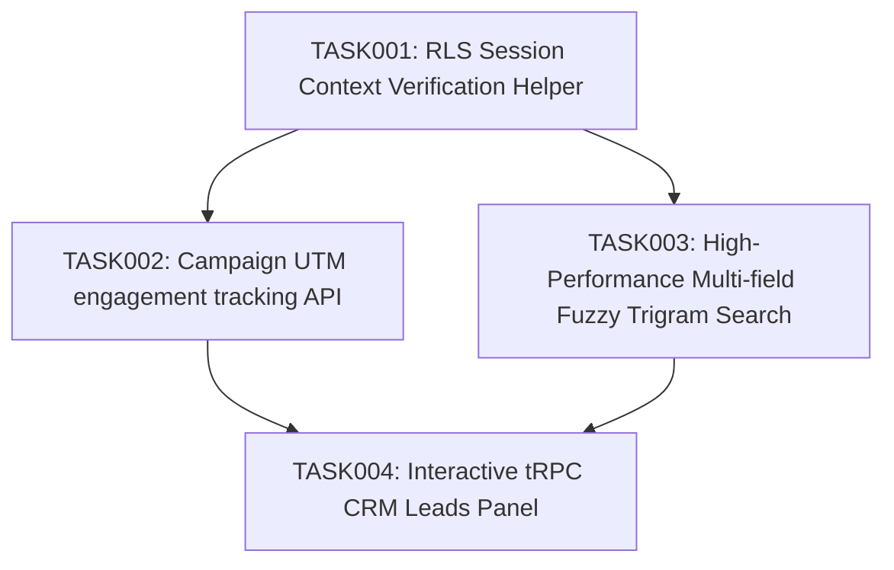

# TRANSFORMATION PLAN ROADMAP (ROADMAP.md)

This roadmap lays out prioritized engineering DAG-dependent phases to optimize the CRM Operating System for high-scale, self-verifying, and multi-tenant feature generation.

---

## 1. Prioritization & DAG Matrix

| Task ID | Impact (1-5) | Feasibility (1-5) | Risk (1-5) | Fit (1-5) | Priority Score | DAG Dependency | Status |
| --- | --- | --- | --- | --- | --- | --- | --- |
| **TASK001** | 5 | 5 | 1 | 5 | **4.7** | None | Unblocked |
| **TASK002** | 4 | 4 | 2 | 5 | **4.0** | TASK001 | Blocked by TASK001 |
| **TASK003** | 4 | 3 | 3 | 4 | **3.3** | TASK001 | Blocked by TASK001 |
| **TASK004** | 5 | 3 | 3 | 5 | **3.8** | TASK002, TASK003 | Blocked by TASK002, TASK003 |

---

## 2. Phase Mappings

### Phase 1: RLS Verification Primitives & Core Harness (TASK001)
- **Objective**: Standardize RLS verification utilities across all mock database stores, creating self-verifying test boundaries.
- **Dependencies**: None.

### Phase 2: Analytics & Indexing Optimizations (TASK002, TASK003)
- **Objective**: Upgrade campaign tracking schemas to support granular link engagements, and implement memory trigram search indexes.
- **Dependencies**: Phase 1.

### Phase 3: Client Panel Integration (TASK004)
- **Objective**: Construct Next.js 16 panel client modules connecting with tRPC query engines.
- **Dependencies**: Phase 2.
